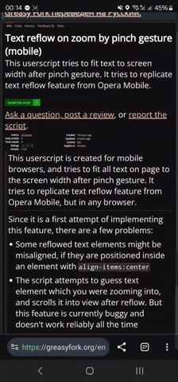

#  Text reflow on zoom (mobile)

This tool tries to fit all text on page to the screen width after pinch gesture on phone. 
It was created to replicate text reflow feature from Opera Mobile, but in any browser. 

It is available as [Userscript](https://raw.githubusercontent.com/emvaized/text-reflow-on-zoom-mobile/refs/heads/main/src/text_reflow_on_zoom.js), and as a browser extension ([Firefox addon](https://addons.mozilla.org/firefox/addon/text-reflow-on-zoom-mobile/), but you can install it manually in any browser after downloading the latest [release](https://github.com/emvaized/text-reflow-on-zoom-mobile/releases)).

#### Short demo

## Known issues

Since it is a first attempt of implementing this feature, there are currently a few problems: 

- Some reflowed text elements might be misaligned, if they are positioned inside an element with `align-items:center`

- The script attempts to guess text element which you were zooming into, and scrolls it into view after reflow. But this feature is buggy and doesn't work reliably all the time

- Some text elements are not proccessed by the script, for example `div` elements, or `span` elements with `display:inline` rule set. I am yet to figure out how to target these elements without too much performance overhead and unwanted reflows

## Support
If you enjoy this project, please consider supporting further development by making a small donation using one of the services below 🙏 

 &nbsp;  &nbsp; 

## Privacy
This tool doesn't collect any private data. It is fully open source, and you can see the code on Github. It requires access to all urls in order to function properly.

## Contributing

If you have any ideas on how it can be improved, please let me know using a [feedback](https://greasyfork.org/en/scripts/514789-text-reflow-on-zoom-by-pinch-gesture-mobile/feedback) form on Greasyfork, or by opening a [new issue ticket](https://github.com/emvaized/text-reflow-on-zoom-mobile/issues/new) or pull request here on Github.
